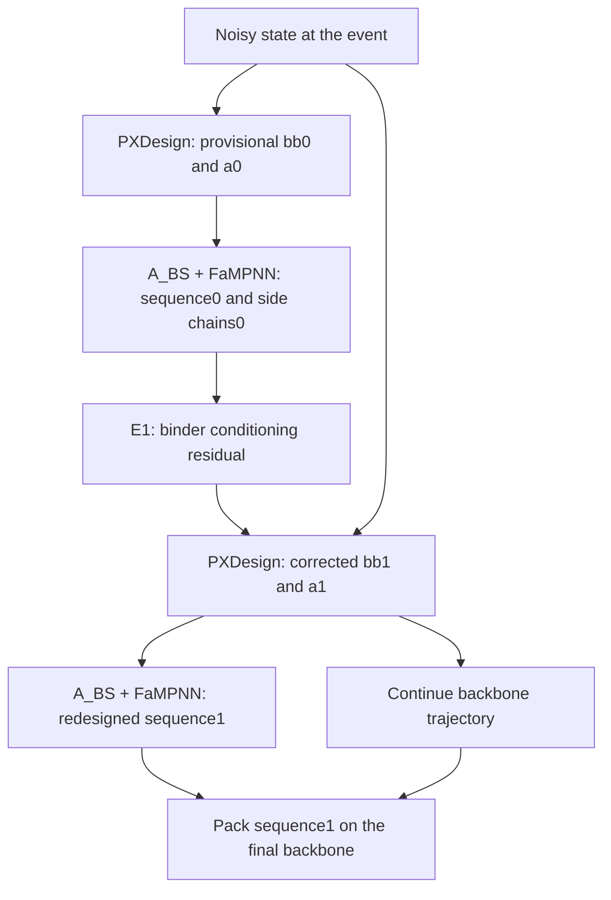

# Sequence re-decoding after E1

Implemented against `exp/binder-design-matrix` at `f2433e9` in the local
`feat/post-feedback-redecode` branch. This is a new inference output policy,
not a new checkpoint or a measured binder-quality result.

## What changes

`event_fixed` (default) preserves the original protocol. Select
`--sequence-policy post_feedback_redesign` to perform a second full FaMPNN
sequence/side-chain decode immediately after the single corrective PXDesign
call, before the solver advances. Both the single-design CLI and the paired
matrix expose the flag.



The new decode uses **bb1 and the freshly tapped a1**, at the same actual,
churned event sigma. A_BS's residual is rebuilt from a1. Binder identities are
reset to X, binder side chains are hidden, and target identities/context use
the existing mapping. It is a new `designer.design(...)` call, not fixed-sequence
packing. The first sequence and its realized side chains remain the inputs
E1 reads. There is no second E1 injection.

The output sequence is held during the rest of the backbone trajectory and
repacked on the final backbone. Final packing uses the second decode's A_BS
residual at the event sigma; this source is recorded. Packing does not redesign
the sequence again. The second event decode also constructs the standard event
products, including one unconditioned packed re-encoding; these are not fed to
E1 again.

## Matched controls

Run **all seven arms** with the same policy: U03, and J03/no-feedback,
E1-bb-only, E1-full for each of the two adapter seeds. Every arm gets a second
decode with seed `generation_seed + 1000003`. Within each J03 seed group, the
original event products remain shared; the second decode is separate for each
arm. Its RNG is protected from the backbone stream.

The primary comparison is **E1-full + redesign versus J03 + redesign**;
full versus bb-only measures the additional effect of the side-chain readout.
Comparing redesigned E1 with the old fixed-sequence J03 would confound feedback
with the extra decode and its new random seed. Likewise, a sequence changing
between the first and second decode within one arm is not evidence that E1
caused it: compare the second decoded sequences across matched arms.

Keep the requested event sigma at **0.429** for this first experiment and record
the realized sigma. Lowering sigma moves the event later. A different event
sigma is a separate experiment. The current ~0.005 Å correction may still leave
the second sequences identical; the implementation opens a causal path but
does not guarantee a measurable gain.

No additional training is required to test this downstream output policy with
the existing J03/E1 checkpoints. It does query A_BS on feedback-conditioned
features, which were not necessarily in its training distribution. Treat this
as a checkpoint-transfer diagnostic, not proof that the joint method was trained
to optimize redesigned sequences. Retraining may be justified after that test;
new event schedules or repeated feedback require separate validation.

## Run on the cluster

Use the existing official PXDesign environment, pinned FaMPNN 0.3 donor,
accepted J03 checkpoints and selected E1 checkpoints. No new training complexes
or caches are needed: this uses the existing prepared binder benchmark target
YAMLs. Do not put the vendored Protenix/PXDesign checkouts before the official
runtime on PYTHONPATH.

For the staged HAI bundle, after activating the same environment and exports as
`scripts/slurm/hai/integrated_official.sh`:

```bash
python scripts/run_integrated_binder_matrix.py \
  --targets-config "$BUNDLE/targets/configs_binder_benchmark/targets.yaml" \
  --prepared-dir "$PREPARED" \
  --checkpoint-dir "$BUNDLE/checkpoints/donors" \
  --checkpoint-selection "$BUNDLE/selection/selected_checkpoints.json" \
  --bs-checkpoint "0=$BUNDLE/checkpoints/bs_seq_sc/J03_seed0_step00000500.pt" \
  --bs-checkpoint "1=$BUNDLE/checkpoints/bs_seq_sc/J03_seed1_step00000500.pt" \
  --fampnn-checkpoint "$BUNDLE/checkpoints/donors/fampnn_0_3.pt" \
  --fampnn-variant 0.3 \
  --targets PDL1 --lengths 80 --seeds 101 \
  --event-sigma 0.429 \
  --sequence-policy post_feedback_redesign \
  --out "$OUTROOT/generation_cell_post_feedback_redesign"
```

On Marlowe, use the same command with its existing prepared-data and checkpoint
paths under the official runtime wrapper. These HAI bundle paths are not assumed
to exist on Marlowe. Use a fresh output directory; do not overwrite the historical
cells. No jobs were submitted by this implementation.

Inspect the generated `designs.csv` and per-design diagnostics before folding:

- Seven outputs, each with `sequence_decode_passes=2` and `redecode_calls=1`.
- Zero conditioning injections for U03/J03 and exactly one for each E1 arm.
- Same first event sequence within a J03 seed group; same re-decode seed across
  paired arms; target identities unchanged.
- Compare `output_sequence` between E1 and its matching J03; record Hamming
  counts, including zeros. The reporter also counts identical paired sequences.
- Actual sigma remains the matched training event. Check final PDB sequence,
  backbone preservation during packing, resolved atom masks and chemistry.
- Compare the backbone trajectory with the fixed-policy invocation under the
  existing GPU replay/noise-floor protocol; an extra FaMPNN decode must not
  advance its RNG stream. Measure the new runtime instead of reusing old costs.

`diagnostics/*.redecode.pt` saves both token sequences, binder mask, bb0/bb1,
actual sigma and decode seed. `diagnostics/*.json` and `designs.csv` record
policy, hook counts, sequence changes and final-pack residual source.
`immediate_event_coordinate_rmsd` covers the flat PXDesign atom axis in the same
event frame; it is not a binder-only backbone RMSD.

`--dump-logits` is explicitly labeled **final fixed-sequence packing**. Those
head outputs are not the second decode's residue-decision trajectory and must
not be used to claim redesign margins.

For the chemistry/paired sequence report:

```bash
python scripts/report_integrated_binder_matrix.py \
  --designs "$OUTROOT/generation_cell_post_feedback_redesign/designs.csv" \
  --out "$OUTROOT/generation_cell_post_feedback_redesign/report"
```

After the real-donor contract checks, score the written PDBs using the existing
AF2-IG workflow. Add its `--metrics-dir` to the report command. The reporter
records the policy and refuses a CSV mixing fixed and redesigned policies.
Keep this protocol separate from the cached-backbone Table 4 collection.

One cell is a plumbing diagnostic. If it succeeds, the next paired pilot is
multiple generation seeds with every arm inside each prefix (e.g. the previously
proposed two targets × eight seeds × one length). Preserve checkpoint, target,
length and seed pairings; report uncertainty over independent prefixes. Do not
select the sigma, checkpoints or targets by these benchmark outcomes.

## Local verification

CPU tests exercise the real event mapping, shared-prelogit hook, solver,
single-arm entry point and paired matrix resume using small deterministic model
doubles. They check masked binder inputs, fixed target sequence, fresh a1,
one E1 injection, actual sequence changes when the correction is sufficient,
final packing's selected sequence, shared first products, hook cleanup, and
RNG preservation under additional random draws. Existing replay tests compare
against the vendored Protenix solver. These are not official-donor CUDA or
binder-quality tests; those remain to run on the cluster.

Verified locally: **72 focused CPU tests passed**; both inference CLIs'
`--help` commands load and expose the new policy. Re-run the focused checks:

```bash
python -m pytest -q tests/test_integrated_redecode.py \
  tests/test_integrated_binder.py tests/test_integrated_event.py \
  tests/test_couple_replay.py tests/test_shared_prelogit.py \
  tests/test_integrated_selection.py
```

The test environment needs the initialized FaMPNN and vendored Protenix trees
on PYTHONPATH. That is a CPU contract-test setup, distinct from the official
cluster runtime required by the generation command above.
